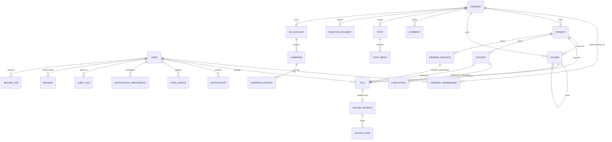

# 05 — Domain Model

Conceptual entities and relationships. Concrete table/column/index design is in [14-database-design.md](14-database-design.md); this document is the narrative and relationship map.

## Entity relationship diagram

## Entities

### User
Global identity, one fixed `role`, credentials (hashed), status, last login, notification preferences, and registered push devices. Access to specific companies comes exclusively through `CompanyMembership` rows — except `agency_admin`, which has implicit access to all companies (see [06-permissions-and-authorization.md](06-permissions-and-authorization.md)).

### Company
A tenant. Owns projects, folders, files, content, campaigns, and every tenant-scoped record transitively. Has an `active`/`archived` status; archiving never deletes data.

### CompanyMembership
Join entity between `User` and `Company`. Carries the *effective* access for that user in that company: implicit from the user's global role, plus optional boolean overrides (`can_manage_campaigns`, `can_delete_company_files`) scoped to that specific membership. This is what lets a manager have campaign rights on Company A but not Company B.

### Project
Generic initiative container, typed by a string/enum (property, product, service, event, campaign, internal, other). Scopes files, folders, content, and pending requests, though files/folders may also attach directly to a company without a project.

### Folder
Organizes files within a company, optionally within a project, optionally nested under a parent folder. Visibility follows company membership, not folder ownership — any member with access to the company sees all its folders (per [06](06-permissions-and-authorization.md)).

### File
Metadata record for an object stored in R2 — never the object itself. Always belongs to a company; optionally to a project/folder/content/pending request. Carries a status pipeline and soft-delete semantics (deletion always goes through the workflow in [06](06-permissions-and-authorization.md#deletion-request-workflow), never a hard delete of the row on request alone).

### UploadSession / UploadPart
Bookkeeping for a resumable multipart upload in progress. `UploadSession` mirrors the R2/S3 multipart upload; `UploadPart` mirrors each committed part for status and cleanup purposes. Resolves to exactly one `File` row on successful completion. Full lifecycle: [07-upload-architecture.md](07-upload-architecture.md).

### Content
A planned editorial item on the calendar: type, scheduled date/time, responsible user, production status, priority, optional related file. Has zero or more `Publication` records (one per social network).

### Publication
One network's publication record for a `Content` item: network, status, publication date, link, responsible user, notes.

### PendingRequest
An actionable ask with a responsible party and optional due date. Distinct from `Comment` (informational) and `Topic` (accountability conversation). May receive file attachments (as responses) and comments.

### Comment
A note or reply attachable to a company, project, file, content item, pending request, or topic reply thread (via a polymorphic `commentable_type` + `commentable_id` pair). May carry a file attachment. May be promoted into a `PendingRequest` (a manual user action, not automatic).

### Topic / TopicReply
`Topic` is the accountability/follow-up conversation described in [03-functional-requirements.md](03-functional-requirements.md#follow-up-topics); `TopicReply` is each sequential message in that thread.

### DeletionRequest
Records a request to delete a `File` or `Content` the requester doesn't own outright, its review, and its outcome. See [06-permissions-and-authorization.md](06-permissions-and-authorization.md#deletion-request-workflow).

### Notification / NotificationPreference / PushDevice
`Notification` is one in-app notification instance (read/unread). `NotificationPreference` is a per-user, per-event-type, per-channel (`in_app` | `push`) toggle. `PushDevice` is one registered browser/device endpoint for Web Push, revocable. Full spec: [08-notifications-and-push.md](08-notifications-and-push.md).

### AdAccount / Campaign / CampaignHistory
`AdAccount` is a registered ad account on Meta Ads or TikTok Ads (manual record, no OAuth/API link in Phase 1). `Campaign` belongs to an ad account and company; every field change is mirrored into `CampaignHistory` (who, when, field, old value, new value, note). Full spec: [09-campaign-management.md](09-campaign-management.md).

### AuditLog
Append-only record of security-relevant actions across the system (login, upload, deletion, permission change, etc.), independent of the per-entity `created_by`/`updated_by` convention — see [16-security-requirements.md](16-security-requirements.md#audited-actions).

### Session
Server-side session record backing authentication — not a stateless token. Enables the "revoke from admin panel" requirement. Full spec: [10-authentication-and-sessions.md](10-authentication-and-sessions.md).

### BackupJob
One manual database backup request: status (`queued/processing/completed/failed`), generated file metadata, expiry. Full spec: [11-backup-and-recovery.md](11-backup-and-recovery.md).

### BrandingSettings
Single global row (Phase 1) holding the admin-configured visual identity (logo, favicon, app name, colors, login branding). Per-company white-labeling is not in Phase 1 scope — see [23-open-questions.md](23-open-questions.md).

## Cross-cutting rules

- **Tenant boundary:** every entity above except `User` (global identity) and `AuditLog`/`Session` (which reference a company only when the action was company-scoped) belongs to exactly one `Company`, directly or transitively through its parent. No entity may reference rows across two different companies.
- **Ownership vs. access:** "who created it" (`created_by`/`uploaded_by`) is never sufficient for an authorization decision by itself — access is always company-membership-driven; ownership only matters for the specific *delete-your-own* rule.
- **Audit columns:** every entity carries `created_at`/`created_by` and, where mutable, `updated_at`/`updated_by`, per [14-database-design.md](14-database-design.md#audit-columns-convention).
