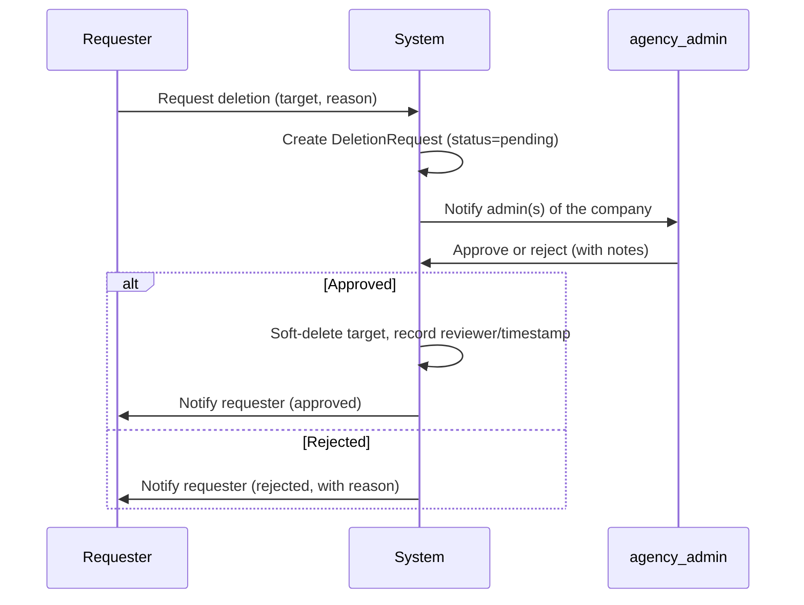

# 06 — Permissions and Authorization

This is the enforcement contract every API endpoint must satisfy. **Nothing here is optional, and nothing here may be enforced only in the frontend.** See [16-security-requirements.md](16-security-requirements.md) for the technical mechanisms (RLS, middleware, etc.) that implement these rules.

## Authorization model

1. **Authenticate** the request (valid session — [10-authentication-and-sessions.md](10-authentication-and-sessions.md)).
2. **Resolve tenant scope** for the request: which `company_id` does this operation target? This is derived from the resource being accessed (e.g., the file's `company_id`), **never** trusted from a client-supplied field without verification.
3. **Resolve the actor's access** to that company:
   - `agency_admin` → always authorized (all companies).
   - Any other role → must hold an active `CompanyMembership` row for that `company_id`.
4. **Resolve the specific action's permission** using the role default plus any membership override.
5. **Deny by default.** Any missing membership, ambiguous tenant resolution, or unhandled role/action combination is a `403`, never a silent allow.

This sequence is a hard requirement for every request handler, not just a suggestion — see the tenant-isolation tests required in [18-testing-strategy.md](18-testing-strategy.md).

## Permission matrix

Legend: ✅ always · 🔶 if membership override grants it · 🔷 own resources only · ❌ never

| Resource / Action | agency_admin | agency_manager | client_manager | contributor |
|---|:---:|:---:|:---:|:---:|
| **Companies** — create/edit/archive | ✅ | ❌ | ❌ | ❌ |
| **Users** — create/edit role/reset password | ✅ | ❌ | ❌ | ❌ |
| **Company membership** — grant/revoke, set overrides | ✅ | ❌ | ❌ | ❌ |
| **Branding settings** — edit | ✅ | ❌ | ❌ | ❌ |
| **Projects** — create/edit | ✅ | ✅ | 🔶 (rare; default ❌) | ❌ |
| **Folders** — create | ✅ | ✅ | ❌ | ✅ |
| **Folders/Files** — view within own company | ✅ | ✅ | ✅ | ✅ |
| **Files** — upload | ✅ | ✅ | ✅ | ✅ |
| **Files** — delete own upload | ✅ | ✅ | ✅ | ✅ |
| **Files** — delete others' upload | ✅ | 🔶 `can_delete_company_files` | ❌ | ❌ |
| **Files/Content** — request deletion | N/A | 🔶 (if not granted direct delete) | ✅ | ✅ |
| **Deletion requests** — approve/reject | ✅ | ❌ | ❌ | ❌ |
| **Calendar/Content** — create/edit | ✅ | ✅ | ❌ | ❌ |
| **Publications** — register/update | ✅ | ✅ | ❌ | ❌ |
| **Pending requests** — create | ✅ | ✅ | 🔶 (rare) | ❌ |
| **Pending requests** — respond | ✅ | ✅ | ✅ | ✅ |
| **Comments/notes** — create | ✅ | ✅ | ✅ | ✅ |
| **Comments/notes** — edit/delete others' | ✅ | 🔶 | ❌ | ❌ |
| **Follow-up topics** — create | ✅ | ✅ | ❌ | ❌ |
| **Follow-up topics** — reply (as responsible party) | ✅ | ✅ | ✅ | ✅ |
| **Campaigns** — view | ✅ | ✅ | ✅ (if visible) | ❌ |
| **Campaigns** — create/edit | ✅ | 🔶 `can_manage_campaigns` | ❌ | ❌ |
| **Dashboards** — agency-wide | ✅ | ✅ (own companies' data) | ❌ | ❌ |
| **Dashboards** — company | ✅ | ✅ | ✅ | Partial |
| **Database backup** — trigger/download | ✅ ⁺ | ❌ | ❌ | ❌ |
| **Audit log** — view | ✅ | ❌ | ❌ | ❌ |

⁺ Triggering a backup additionally requires step-up reauthentication regardless of role — see [10-authentication-and-sessions.md](10-authentication-and-sessions.md#reauthentication-for-sensitive-operations-approved-2026-09-14).

## Company membership & permission overrides

`CompanyMembership(user_id, company_id, status, can_manage_campaigns, can_delete_company_files)`:

- Required for every non-`agency_admin` user to access a company at all.
- `can_manage_campaigns` and `can_delete_company_files` default to `false` and are set per membership by an `agency_admin` — this implements the source requirement that a manager's campaign and deletion rights are "conforme permissão configurada" (per configured permission), and may legitimately differ across the same manager's different client assignments.
- A revoked/inactive membership immediately removes all access to that company, including previously-created resources — verified by the tenant-isolation test suite ([18](18-testing-strategy.md)).

### Multi-company membership is supported for every role

Any user of **any** role may hold more than one active `CompanyMembership` row, when an `agency_admin` grants it — this is not limited to internal staff:

- An `agency_manager` or `agency_admin` is commonly assigned to several client companies — the expected common case.
- A `contributor` who freelances across multiple clients of the agency (a common real-world case for the "corretor" persona — [02-personas-and-roles.md](02-personas-and-roles.md#contributor-contributor)) can hold a membership in each, with independent `can_delete_company_files` overrides per company.
- A `client_manager` representing a client that operates more than one registered `Company` (e.g., a corporate group with several brands under one contract) can likewise hold multiple memberships.
- Nothing in the data model, the permission checks, or the UI assumes a user has exactly one company — every access check iterates the actor's full set of active memberships (or, for `agency_admin`, all companies implicitly). This was a documented open question in an earlier draft of this spec ([23-open-questions.md](23-open-questions.md)) and is now confirmed as intended behavior, not merely "not prevented by the schema."

## Deletion request workflow

Applies whenever a `contributor`, `client_manager`, or a `agency_manager` without `can_delete_company_files` wants a `File` or `Content` removed that they did not create.

Rules:
- **Only the `agency_admin` role can review.** There is no company-scoped "admin" tier in this role model ([02-personas-and-roles.md](02-personas-and-roles.md)) — `agency_admin` has implicit access to every company by design, so the reviewer pool is simply "any `agency_admin`," and the review UI's default view (filtered to the requester's company for convenience) carries no authorization weight of its own. An `agency_manager`, regardless of `can_delete_company_files`, can never approve/reject a deletion request — that override only grants *direct* deletion, not review authority over other users' requests.
- Every step (`request`, `approve`, `reject`, resulting `delete`) records actor, timestamp, and reason/notes — full history retained on the `DeletionRequest` row (never overwritten).
- The underlying deletion is a **soft delete** (`deleted_at` timestamp), not a row purge, so an erroneous approval remains recoverable at the database level — see [16-security-requirements.md](16-security-requirements.md#protection-against-accidental-or-malicious-deletion).
- No data may cross the company boundary at any step of this flow (notification recipients, reviewer eligibility, and the visible request list are all company-scoped).

## Server-side enforcement points (non-negotiable)

- Every list/detail endpoint filters by the resolved company scope at the query level (not filtered after fetching).
- Every mutation endpoint re-verifies ownership/membership/override immediately before writing — never relies on a prior read having been "already checked."
- File download/upload URLs are minted only after the same authorization check, and are scoped (see [07-upload-architecture.md](07-upload-architecture.md#authorization)).
- The `company_id` on any incoming request body is **advisory only** for routing; the authoritative company for an existing resource always comes from the database record, never the request payload.

## Preventing access by manipulating IDs or URLs (anti-IDOR)

This is the concrete mechanism behind "deny by default" above — it answers "what stops a user from just changing the ID in the URL or request body to reach another tenant's resource?"

1. **Every single-resource data-access function takes the actor's authorized company scope as a mandatory parameter, not an optional one, and filters in the SQL itself.** The codebase never has a bare `findById(id)` helper for a tenant-owned table — the signature is always `findById(id, authorizedCompanyIds)`, compiling down to `WHERE id = :id AND company_id = ANY(:authorizedCompanyIds)`. A mismatched ID/scope combination returns no row, which the handler turns into a `404` — it never loads the row first and checks its `company_id` in application code afterward, because that pattern is one accidentally-skipped `if` away from a leak, whereas baking the scope into the query itself cannot be forgotten without the code failing to compile against the repository function's required parameter.
2. **UUID primary keys ([14-database-design.md](14-database-design.md#audit-columns-convention)) are enumeration-resistance, not the authorization boundary.** Guessing or observing a valid UUID for another tenant's file must still fail the scope check in (1) — the system never relies on IDs being hard to guess as a substitute for checking access.
3. **This pattern is independently backed by PostgreSQL RLS** ([14-database-design.md](14-database-design.md#row-level-security-defense-in-depth-and-how-prisma-must-use-it)) — even if (1) were implemented incorrectly for a given endpoint, the database itself would still return zero rows for an out-of-scope query, because the RLS policy applies regardless of what `WHERE` clause the application sent.
4. **Path, query, and body parameters named `companyId`/`company_id` are never used as the scope for a query** — they are, at most, used to pick *which* of the actor's already-authorized companies a create/list operation targets, and that value is itself validated against the actor's authorized set before use, never trusted as the set.
5. Tested explicitly: the tenant-isolation suite in [18-testing-strategy.md](18-testing-strategy.md) includes attempts to access another company's resource by ID with a valid session for a *different* company, for every resource type and every role — all must fail identically whether the ID exists in another tenant or doesn't exist at all (both return `404`, so existence in another tenant is never distinguishable from non-existence).
