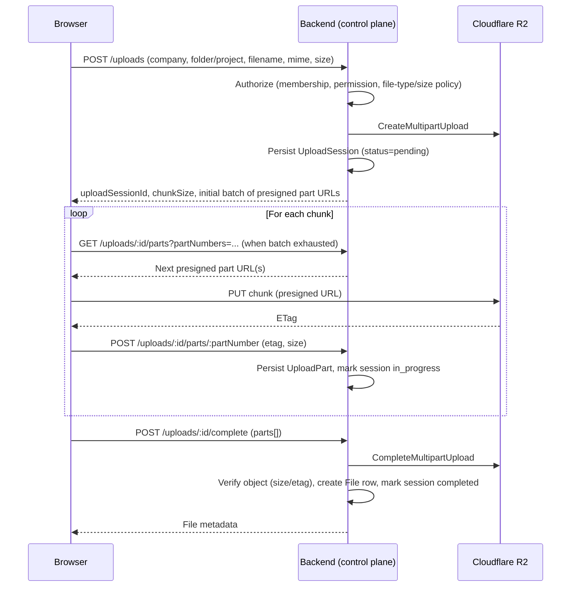
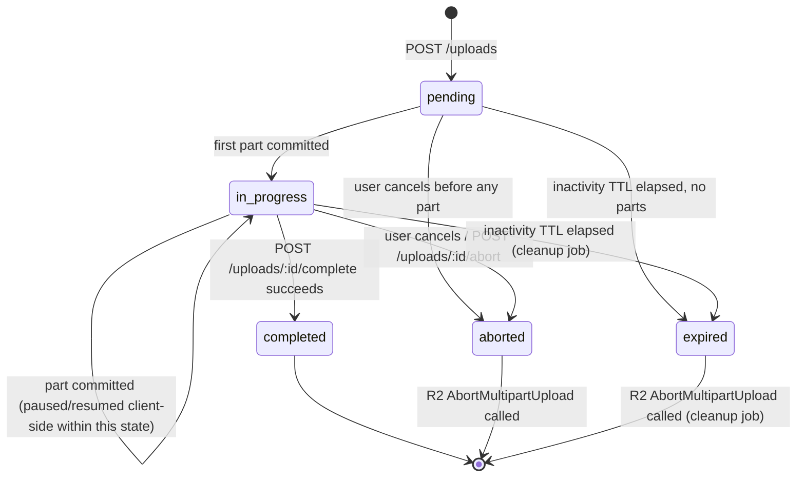

# 07 — Upload Architecture

Uploads are the single most critical subsystem in this platform — the source requirements call it out explicitly, and it's where mobile-first, performance, and low-infra-cost constraints collide hardest. This document is authoritative over the general mention of uploads in [03-functional-requirements.md](03-functional-requirements.md).

## Requirements summary

- Support files up to **30 GB**, with the maximum configurable by an admin (not a hardcoded constant).
- Multiple simultaneous uploads, with configurable concurrency.
- Multipart/chunked upload, resumable across network interruptions and app restarts.
- Automatic retry with backoff for transient failures.
- Pause, resume, and cancel, user-initiated, at any point.
- Per-file and overall (queue) progress.
- **No full-file buffering** in the browser, the backend, or the VPS at any point — the file streams directly from the device to Cloudflare R2.
- Abandoned uploads (started, never completed) are cleaned up automatically.
- Every upload is authorized server-side before it starts, and every part/completion call is re-validated.
- Strong mobile network behavior: must tolerate flaky/slow connections without losing progress.

## Core architecture decision

**Direct-to-R2 multipart upload using presigned URLs**, orchestrated by the backend but never touched by the backend's data plane:

- The backend's role is strictly control-plane: authenticate, authorize, create the upload session, mint presigned part URLs, validate completion, and persist metadata.
- The browser's role is the data plane: it reads the file in chunks (via the File/Blob API) and PUTs each chunk directly to R2 using the presigned URL.
- Cloudflare R2 exposes an S3-compatible multipart upload API, so the backend orchestrates this with **`@aws-sdk/client-s3`** (AWS SDK v3, `CreateMultipartUpload`, presigned `UploadPart` URLs via `@aws-sdk/s3-request-presigner`, `CompleteMultipartUpload`, `AbortMultipartUpload`, `ListParts`), pointed at R2's S3-compatible endpoint.

This satisfies "no full file in backend/VPS memory" by construction — the backend never receives file bytes for the upload path.

## Client library: Uppy (final decision)

**Final for Phase 1** — see [ADR-0008](../decisions/0008-upload-client-library.md). The browser side uses **Uppy** (`@uppy/core` + `@uppy/aws-s3`), used *headless* (our own UI components drive it — we do not adopt `@uppy/dashboard`'s prebuilt UI, to stay consistent with [12-ui-ux-guidelines.md](12-ui-ux-guidelines.md)) and in **self-hosted-signing mode**: our own backend implements the small set of endpoints Uppy's `@uppy/aws-s3` plugin expects for a signer, and file bytes go straight from the browser to R2 exactly as in the hand-rolled design above. We deliberately do **not** use Uppy's optional "Companion" server — Companion is a relay service that proxies uploads through itself, which would violate the "no file bytes through the backend/VPS" requirement. Choosing a maintained library instead of hand-rolling chunking/retry/pause/resume/progress logic reduces the amount of custom, safety-critical upload code we have to get right ourselves, while keeping the exact architecture already decided in [ADR-0003](../decisions/0003-upload-architecture.md).

The backend's control-plane endpoints (below) are shaped to match what `@uppy/aws-s3` expects from a self-hosted signer, so the browser-side integration is thin configuration, not custom protocol code.

## Status of the numeric defaults below (approved 2026-09-14)

Every number in this section — chunk size, concurrency limits, retry backoff, TTLs — is an **initial configuration value**, not a fixed rule baked into the architecture. Each is read from configuration (environment variable or an admin-configurable setting, per the existing "admin-configurable max file size" requirement) rather than hardcoded, specifically so it can be tuned without a code change once real-world data exists. See [Validation plan](#validation-plan-real-devices-and-unstable-networks) below for how these specific starting values will be confirmed or adjusted before Stage 6 locks in whatever the validated numbers turn out to be.

## Multipart constraints and chunk sizing (initial configuration values)

Cloudflare R2's S3-compatible multipart API inherits S3's constraints:
- Minimum part size: **5 MiB** (except the last part, which may be smaller).
- Maximum part size: **5 GiB**.
- Maximum parts per upload: **10,000**.

**Default part size: 16 MiB**, admin-configurable in the range 8–64 MiB. At 16 MiB, a 30 GB file uses ≈1,920 parts — comfortably under the 10,000-part ceiling, leaving headroom to raise the admin-configurable max file size well beyond 30 GB (up to ≈156 GB at 16 MiB parts) without ever changing the chunk-size default. If the max file size is ever configured high enough that `fileSize / partSize` would approach 10,000, the backend computes an adjusted part size for that session as `max(16 MiB, ceil(fileSize / 9000))` — a formula, not a value hardcoded per file size, so it never needs revisiting as the admin-configurable ceiling changes.

16 MiB is chosen (rather than a larger, more throughput-optimal size) specifically for mobile resilience: the requirement to prioritize "stability and recovery over raw speed" means a failed chunk should cost as little re-transmitted data as possible on an unstable connection — see [23-open-questions.md](23-open-questions.md) for tuning this default against real device/network testing before Stage 6 locks it in.

## Concurrency (initial configuration values)

- **Per file:** up to **3 parts uploading in parallel** by default (configurable 1–6). Kept conservative by default because mobile connections often have limited effective parallelism before contention makes things worse, not better.
- **Per queue:** up to **2 files uploading in parallel** by default (configurable 1–5).
- **Per company/user, server-side:** up to **5 concurrent active `upload_sessions`** by default — bounds control-plane load (presigned-URL issuance, part bookkeeping), independent of the data-plane cost which R2 absorbs directly.
- All three are admin-configurable settings, not hardcoded constants, consistent with the admin-configurable max file size requirement.

## Upload lifecycle

Presigned part URLs are minted in **batches of 10**, each with a **20-minute TTL**, so that a changed permission or expired session is caught before too much is issued, and so a URL doesn't expire mid-upload for very large files (the client requests the next batch once it has consumed roughly half the current one, so it never stalls waiting on a fresh batch).

### States and state machine

`UploadSession.status`: `pending → in_progress → completed | aborted | expired`

Surfaced to the user as: **aguardando, enviando, processando, concluído, pausado, cancelado, falhou** (per [12-ui-ux-guidelines.md](12-ui-ux-guidelines.md)). "Paused" and "processing" are client-side/derived states over the same `in_progress` session — pausing simply stops issuing PUTs; the session and already-committed parts remain valid until the presigned URLs' TTL or the session's own expiry, whichever governs resumability (see below).

`aborted` and `expired` are both terminal and both trigger `AbortMultipartUpload` on R2 — they differ only in *why* the session ended (explicit user action vs. inactivity), which matters for the audit trail and UI messaging but not for the cleanup behavior.

## Resumability

- The client persists (e.g., IndexedDB, via Uppy's own resumability support in `@uppy/aws-s3`) the `uploadSessionId`, a file fingerprint (name + size + last-modified), and the list of already-committed part numbers.
- On resume (page reload, network back online, app reopen), the client calls `GET /uploads/:id`. **The backend does not simply return its own `upload_parts` mirror as ground truth — it reconciles against R2's own `ListParts` response before answering.** The `upload_parts` table is a performance cache (avoids an R2 round-trip on every progress update); `ListParts` on R2 is the actual source of truth, because a part can succeed on R2 while the client's follow-up "register this part" call to the backend fails (network drop right after the PUT), which would otherwise make the backend's mirror understate what's really been uploaded and cause a redundant re-upload of an already-committed part.
- If the fingerprint doesn't match a persisted session, the client starts a new session rather than risk corrupting an unrelated upload.
- Expired sessions (past the inactivity TTL — see below) cannot be resumed; the client must start over and the backend aborts the multipart upload on R2 during cleanup.
- The same `ListParts` reconciliation runs as a final check inside `POST /uploads/:id/complete`, immediately before calling `CompleteMultipartUpload` — the completion call always uses R2's authoritative part/ETag list, never a client-supplied one, so a client cannot claim a part is committed when it isn't.

## Retry strategy (initial configuration values)

- Per-chunk PUT failures retry automatically with **exponential backoff: 1s, 2s, 4s, 8s, 16s (5 attempts total), ±20% jitter** to avoid synchronized retry storms across many parts, before surfacing an error for that chunk to the UI.
- A failed part does not fail the whole upload — only that chunk is retried; other chunks may continue in parallel up to the concurrency limit.
- Network loss mid-upload: client detects (failed requests / `navigator.onLine`), pauses automatically, and resumes automatically once connectivity returns, without user action required beyond the initial "resume" affordance if the app was closed.
- These are Uppy's `@uppy/aws-s3` retry defaults, tuned to the numbers above via its configuration options — not reimplemented by hand.

## Backend endpoint contract (Uppy-compatible self-hosted signer)

Shaped to match what `@uppy/aws-s3` expects from a self-hosted signer, so the client integration is configuration, not custom protocol code:

| Endpoint | Purpose |
|---|---|
| `POST /uploads` | Create session: authorize, validate file policy, call R2 `CreateMultipartUpload`, persist `UploadSession`, return `uploadSessionId` |
| `GET /uploads/:id/parts?partNumbers=1,2,3` | Return presigned `UploadPart` URLs for the requested part numbers (issued in batches of 10, 20-minute TTL — see above) |
| `POST /uploads/:id/parts/:partNumber` | Register a committed part (ETag, size) after the browser's direct PUT to R2 succeeds; updates the `upload_parts` mirror |
| `GET /uploads/:id` | Resume: return the reconciled (against R2 `ListParts`) list of committed parts |
| `POST /uploads/:id/complete` | Finalize: reconcile against `ListParts`, call R2 `CompleteMultipartUpload`, create the `File` row, mark session `completed` |
| `POST /uploads/:id/abort` | Cancel: call R2 `AbortMultipartUpload`, mark session `aborted` |

Every one of these re-runs the full authorization check in [Authorization](#authorization) below — none of them trust a prior call's result.

## Abandoned upload cleanup (concrete parameters)

Background job (pg-boss, see [13-technical-architecture.md](13-technical-architecture.md#background-jobs)), **runs hourly**:
- Finds `UploadSession` rows `pending`/`in_progress` with **no part activity for 24 hours** (the inactivity TTL).
- Calls `AbortMultipartUpload` on R2 (releases R2-side storage for uncommitted parts — R2, like S3, bills for incomplete multipart parts until aborted or lifecycle-expired).
- Marks the session `expired` and deletes associated `UploadPart` bookkeeping rows.
- This job is a hard requirement, not an optimization — leaving abandoned multipart uploads unaborted directly costs storage.
- As a second, independent safety net (defense-in-depth, matching the RLS pattern used for tenant isolation), the R2 bucket also has a **lifecycle rule aborting incomplete multipart uploads after 7 days**, in case the application-level job is ever down or buggy — R2/S3 supports this natively at the bucket level, at no additional engineering cost.

## Authorization

Every control-plane call (`create session`, `request part URLs`, `complete`, `abort`) re-checks:
1. Session authentication.
2. Company membership for the target company.
3. Upload permission (all four roles can upload; this is about tenant/folder scope, not role).
4. File policy: MIME type allow-list, max size (admin-configurable, default 30 GB), and any folder/project-level restriction.

Presigned URLs are generated with the minimum necessary scope (single object key, single HTTP method, short TTL) and are never reused across sessions or users.

## Failure scenarios (must be explicitly handled)

| Scenario | Expected behavior |
|---|---|
| Network drops mid-chunk | Retry with backoff; if exhausted, mark chunk failed, pause file, allow manual/automatic resume |
| App closed mid-upload | Session and committed parts persist server-side; resumable on reopen via fingerprint match |
| Presigned URL expired before use | Client requests a fresh batch transparently |
| User cancels | Client stops sending; backend aborts the R2 multipart upload and marks session `aborted` |
| Server restarts mid-session | No data loss — all state is in Postgres/R2, not in server process memory |
| Duplicate completion call | Idempotent — backend checks session status before re-completing |
| File exceeds configured max size | Rejected at session creation, before any bytes are transferred |
| Disallowed MIME/extension | Rejected at session creation |
| Permission revoked mid-upload | Next control-plane call (part request or complete) re-checks and rejects; already-issued presigned URLs are short-lived enough to bound the exposure window |

## Metadata persisted per file

Original name, MIME type, size, uploader, company, project/folder, optional linked content/pending request, upload timestamp, current status. See [14-database-design.md](14-database-design.md#core-tables) for the schema.

## Mobile considerations

- Chunk size (16 MiB default — see [above](#multipart-constraints-and-chunk-sizing-initial-configuration-values)) is deliberately smaller than a desktop-optimized flow would use, to reduce the cost of a single failed chunk on an unstable mobile connection.
- Upload continues correctly if the browser tab is backgrounded, to the extent the mobile OS/browser allows background fetch — the UX must clearly communicate when a background limitation pauses the upload rather than silently losing progress.
- Previews and video playback are always on-demand — never triggered automatically by the upload flow or by loading a file list.

## Why not `tus`?

The `tus` resumable-upload protocol was considered and rejected for this architecture: a `tus` server (e.g., `@tus/server` with `@tus/s3-store`) receives the client's `PATCH` bytes itself and relays them into S3-compatible storage — even streamed without buffering, that means every uploaded byte still passes through the VPS's network interface and CPU, which directly conflicts with the already-decided, non-negotiable requirement that file bytes go straight from the browser to R2 ([ADR-0003](../decisions/0003-upload-architecture.md)) and would make the VPS a bandwidth bottleneck for exactly the files (largest) where that matters most. Uppy's `@uppy/aws-s3` plugin achieves the same client-side resumability/retry/progress guarantees without that trade-off, which is why it was chosen instead — see [ADR-0008](../decisions/0008-upload-client-library.md).

## Validation plan (real devices and unstable networks)

Before Stage 6 treats the numbers above as validated (as opposed to "reasonable starting configuration"), run the following as part of that stage's acceptance work — not a separate research project, but a concrete, time-boxed test pass using the Uppy-based prototype built for Stage 6 itself:

1. **Device matrix:** at least one low-end and one mid-range Android device on real mobile data (not just emulation), plus one iOS Safari device (relevant given iOS Safari's different networking/background behavior — [23-open-questions.md](23-open-questions.md)).
2. **Network conditions:** (a) stable Wi-Fi as a baseline, (b) throttled 4G via Chrome DevTools / Playwright network emulation, (c) a real-world unstable condition — e.g., a moving vehicle or a location with known poor signal — specifically to observe mid-upload drop/resume behavior that emulation can't fully reproduce.
3. **Test file sizes:** a small file (~50 MB, fast path sanity check), a medium file (~2 GB, typical real usage), and a large file (~20–30 GB, the stated ceiling) to confirm the part-count/chunk-size formula holds up in practice, not just in the spec's arithmetic.
4. **Metrics captured per run:** completion success/failure, total time, number of chunk retries triggered, whether a forced app-close-and-resume mid-upload correctly continues (not restarts) from the `ListParts`-reconciled point, and peak browser memory usage (to catch any accidental full-file buffering regression).
5. **Adjustment rule:** if the default 16 MiB chunk size produces an unacceptable retry rate on the throttled/unstable conditions above, reduce it (e.g., to 8 MiB) rather than increasing concurrency — smaller, more frequent chunks is the correct lever for an unreliable connection, per the "stability over raw speed" requirement; if throughput on stable Wi-Fi is unnecessarily slow, concurrency is the lever to raise, not chunk size.
6. **Sign-off:** the validated (possibly adjusted) defaults are recorded back into this document and into the admin-configurable settings' shipped defaults — Stage 6 is not considered done until this pass has run at least once, per [21-mvp-roadmap.md](21-mvp-roadmap.md) Stage 6's acceptance criteria.

This plan — not just the existence of an open question — is what "documented how it will be validated" means for this spec; see [23-open-questions.md](23-open-questions.md) for the tracking entry.
