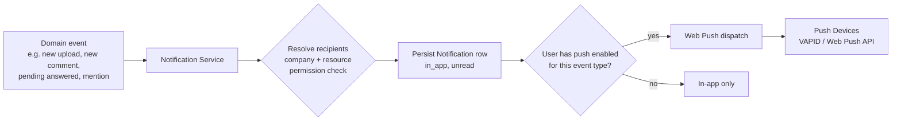
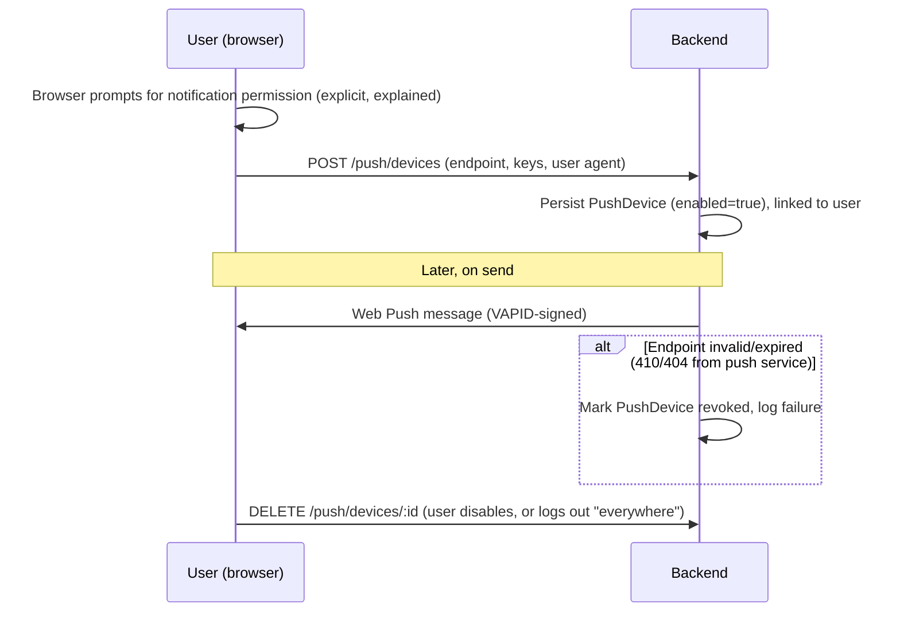

# 08 — Notifications and Push

The internal notification center and push notifications are **one system with two delivery channels**, not two separate features — this is a hard architectural requirement from the source spec ("a arquitetura deve permitir push notifications sem reescrever a lógica de notificações"). Both ship in Phase 1.

## Architecture

The **Notification Service** is a distinct module (own directory/package, own queue consumer — see [13-technical-architecture.md](13-technical-architecture.md#code-organization)) so a future channel (email in Phase 2, SMS, etc.) plugs in without touching event-emission code elsewhere in the app.

## Event catalog (Phase 1)

New upload, new comment, new note, new pending request, pending request answered, file sent (as a response), status change (content/publication/campaign), content overdue, approval requested, project change, campaign flagged as "needs attention," user mentioned, follow-up topic created, follow-up topic reply, deletion request created/approved/rejected.

## Recipient resolution rules

- Never resolves a recipient outside the event's company — this is checked at resolution time, not assumed from the event source.
- Recipient categories: specific user(s), the task's responsible party, users involved in the related project, all authorized users of a company, agency admins (only when the event is agency-wide-relevant, e.g., a deletion request).
- Every recipient's *current* access to the underlying resource is re-verified at send time (not cached from when the resource was created) — a since-revoked membership must not receive the notification.

## Deduplication & anti-spam (concrete parameters)

- No duplicate notification for the same (recipient, event, resource, unread-state) tuple — e.g., three rapid edits to the same content collapse into one unread notification, updated in place, not three rows.
- Follow-up topic replies: repeated replies to the same still-unread thread do not each trigger a separate push — see [03-functional-requirements.md](03-functional-requirements.md#follow-up-topics).
- **Push-specific rate limit (final default):** at most **1 push notification per (recipient, resource) pair per 5-minute window** — further events on the same resource within that window still create/update the in-app notification immediately, but push delivery is debounced to the end of the window as a single, updated push. This bounds worst-case push volume during a burst of activity on one file/content/thread without delaying the in-app center, which remains real-time.
- **Global per-user push ceiling (final default):** at most **20 push notifications per user per hour** across all resources — a hard ceiling for pathological cases (e.g., a very active shared project); once hit, further events continue to appear in the in-app center only until the window rolls over.
- These thresholds are configuration, not hardcoded constants, so they can be tuned post-launch based on real usage without a code change.

## Failure fallback

- **The in-app notification is always created first and is authoritative, regardless of push outcome** — push is a best-effort delivery accelerant on top of it, never a dependency for the event to be visible at all.
- If Web Push delivery fails for a reason other than an invalid/expired endpoint (e.g., a transient error from the push service), the failure is logged and **no automatic retry queues indefinitely** — the next event for that user will attempt push again normally; a single missed push is an accepted, low-consequence outcome exactly because the in-app center is unaffected.
- If **every** registered device for a user fails delivery, no further fallback channel exists in Phase 1 (email is explicitly Phase 2 — see [01-product-scope.md](01-product-scope.md)); the user is expected to see the event next time they open the app, via the always-current in-app center and unread counter.
- This is a deliberate, accepted Phase 1 limitation, not an oversight: it keeps the notification pipeline simple (one guaranteed channel, one best-effort channel) until Phase 2 adds email as a second, more persistent fallback.

## Read/unread behavior

- Every notification has `read_at` (null = unread).
- Unread counter shown in the UI at all times.
- Mark-as-read: single notification or bulk "mark all as read."
- Opening a notification navigates (deep-links) to the related resource **and** marks it read in the same action.

## Deep link mapping

| Notification type | Deep link target |
|---|---|
| New upload / file status change | File detail within its folder/project |
| New comment / note | The commented resource, scrolled to the comment |
| Pending request created/answered | Pending request detail |
| Content status change / overdue | Calendar content detail |
| Publication status change | Content detail, publications tab |
| Campaign flagged | Campaign detail |
| Follow-up topic created/replied | Topic thread |
| Deletion request created/approved/rejected | Deletion request detail (admin) or the affected file (requester) |
| Mention | The resource where the mention occurred |

## Push notifications (Web Push)

Chosen over a native-app push provider because the product is a responsive web app, not a native app — see [13-technical-architecture.md](13-technical-architecture.md#technology-decisions) and [ADR-0005](../decisions/0005-push-notifications.md).

### Device registration lifecycle

- **Feature detection before anything else (approved 2026-09-14):** if the browser/device doesn't support the Push API and Service Workers at all (older browsers, some in-app webviews, and — historically — some iOS Safari versions, see [23-open-questions.md](23-open-questions.md)), the UI never shows a permission prompt or a broken "enable push" control in the first place — it silently falls back to in-app-only, exactly as if the user had declined. This applies uniformly to *any* unsupported browser or device, not a hardcoded iOS Safari check, so the app degrades gracefully as browser support inevitably changes over time.
- Explicit permission request, with an explanation of purpose shown before the browser prompt (never prompt on page load without context).
- Multiple devices per user (each browser/device registration is a separate `PushDevice`).
- User can disable push globally or per registered device from account settings.
- Invalid/expired push tokens (delivery failure from the push service) are detected on send and the device is marked revoked — never retried indefinitely.
- All push payloads are scoped to a single company/resource the recipient currently has access to; the payload itself carries no sensitive content beyond what's safe to show in a lock-screen preview (title + short message; full content requires opening the app).

### Preferences

`NotificationPreference(user_id, event_type, channel, enabled)` — a user can disable push for a specific event type while keeping in-app notifications for it, and vice versa is not applicable (in-app is always on; it's the system of record). Defaults are sensible out of the box (e.g., mentions and pending requests default on; lower-signal events like generic status changes may default to in-app only).

## Tenant isolation

Every rule above is subordinate to: **a user never receives a notification (in-app or push) about a resource in a company they don't currently have access to.** This is tested explicitly — see [18-testing-strategy.md](18-testing-strategy.md#coverage-by-area-required-per-the-source-spec).
