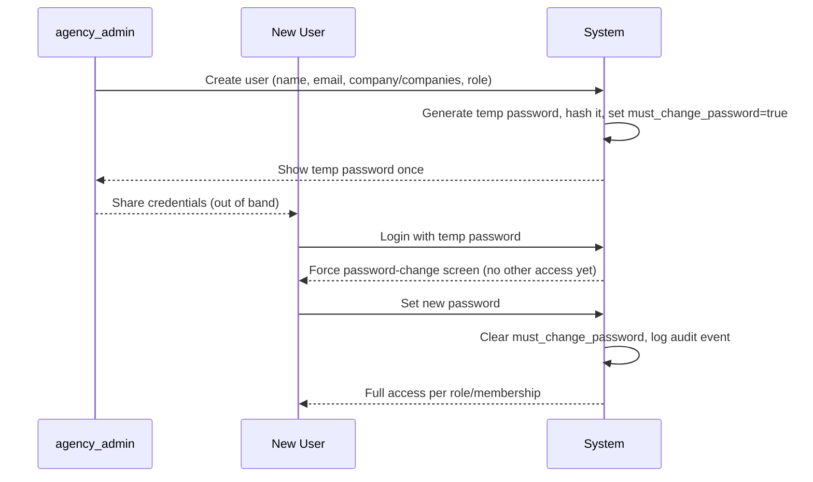

# 10 — Authentication and Sessions

## Password handling

- Passwords are **never** stored in plain text and **never** recoverable — hashed with **Argon2id** (final decision — see [ADR-0009](../decisions/0009-security-parameters.md)), with a per-password salt (built into the algorithm) and a server-side pepper stored as a secret (see [16-security-requirements.md](16-security-requirements.md#secrets-management)). **Concrete parameters (final default, tunable to VPS capacity during Stage 2):** memory cost 19 MiB, iterations 2, parallelism 1 — the OWASP-recommended minimum for Argon2id, chosen as the starting point because Phase 1 runs on a single shared VPS where hashing cost competes with the application's own CPU/memory; revisit upward if the production VPS sizing ([23-open-questions.md](23-open-questions.md)) comfortably allows it.
- No feature ever displays a user's original password to an admin or anyone else — not in the UI, not in logs, not in the database.
- Account creation: `agency_admin` sets an initial password when creating a user (or the system generates one) — the plaintext is shown to the admin **exactly once**, at creation time, then discarded server-side (only the hash persists).
- Admin-triggered reset: `agency_admin` can generate a new temporary password for any user at any time. Same one-time-display rule applies.
- **Forced change:** any account with a temporary/admin-set password (flag: `must_change_password`) is required to set a new password immediately on next login before accessing anything else.
- Users can change their own password at any time (requires current password).
- Every admin-driven password action (initial set, reset, temp password generation) writes a `PasswordResetAudit` row: target user, performing admin, action type, timestamp. This is separate from — and in addition to — the general `AuditLog` (see [16-security-requirements.md](16-security-requirements.md#audited-actions)).
- **Email-based self-service password recovery is Phase 2.** Phase 1 relies entirely on admin-driven reset — this is an accepted Phase 1 limitation, not an oversight (see [23-open-questions.md](23-open-questions.md)).

## Sessions

- **Server-side sessions**, not stateless-only JWTs — a `Session` row per active login (user, session token hash, IP, user agent, created/last-active/expires timestamps, `revoked_at`). This is required because the spec demands sessions be individually revocable from the admin panel; a purely stateless token can't satisfy that without already maintaining server-side revocation state, at which point a real session table is simpler and more auditable. See [ADR-0006](../decisions/0006-authentication-sessions.md).
- The client holds an opaque session identifier in an **httpOnly, `Secure`, `SameSite=Lax` cookie** — never in `localStorage`, to reduce XSS token theft exposure.
- **Duration (final default):** sliding expiry of **7 days**, renewed on activity (each authenticated request within the current validity window pushes `expires_at` forward by 7 days from now), up to a **hard cap of 30 days** since the original login, forcing periodic re-authentication regardless of activity. Both numbers are shipped as concrete Phase 1 defaults (not placeholders) but are read from configuration, not hardcoded, so they can be tuned post-launch without a code change.
- **Revocation:** an `agency_admin` can revoke any specific session or all sessions for a user ("log out everywhere") from the admin panel. A user can also revoke their own other sessions from account settings. Revocation takes effect on the very next request (session lookup checks `revoked_at`).
- Session token itself is a high-entropy random value; only its hash is stored (so a database read alone can't be replayed as a valid session, mirroring password-hash hygiene).

## Login abuse protection (concrete parameters)

- **Per-account lockout:** after **5 consecutive failed attempts**, the account enters exponential backoff — the next attempt is blocked for 30s, doubling on each further consecutive failure (30s, 1m, 2m, 4m, ...) up to a **cap of 15 minutes**, resetting on a successful login.
- **Per-IP rate limit:** at most **20 login attempts per hour** from a single IP address, independent of which account(s) are targeted — blunts distributed low-and-slow guessing across many accounts from one source.
- Both are final defaults for Phase 1, configurable without a code change (see [16-security-requirements.md](16-security-requirements.md#rate-limiting)).
- Generic error message on failed login (never reveal whether the email exists).
- Failed and successful login attempts are recorded in the audit log with IP and timestamp.

## Session theft mitigations

- Cookie flags above prevent script-based exfiltration (httpOnly) and reduce cross-site leakage (SameSite).
- Optional (recommended) session binding to a coarse device/user-agent fingerprint, invalidating on a hard mismatch, without being so strict that normal browser updates log users out.
- All authentication traffic over HTTPS only (enforced at the reverse proxy — [13-technical-architecture.md](13-technical-architecture.md)).

## Reauthentication for sensitive operations (approved 2026-09-14)

A valid session is enough to use the product day-to-day, but a small set of operations whose consequences are severe and hard to reverse require **step-up reauthentication** immediately before they execute — proving the actor is still actively present and not, for example, an attacker who inherited an unattended, already-unlocked browser tab.

- **Mechanism:** if the user's last password verification (login, or a previous step-up) was more than **15 minutes** ago, the sensitive action is blocked with a prompt to re-enter their current password; a successful re-entry records a fresh verification timestamp on the session and the action proceeds immediately. This does **not** create a new session or extend the sliding expiry beyond what normal activity already does — it's a separate, narrower check layered on top of the existing session.
- **Phase 1 scope: manual database backup generation** ([11-backup-and-recovery.md](11-backup-and-recovery.md)) requires step-up reauthentication before the backup job is enqueued. This is the confirmed baseline; see [23-open-questions.md](23-open-questions.md) for whether additional operations (e.g., changing another user's role, revoking all of a user's sessions) should get the same treatment — a reasonable case exists for them, but only backup generation was explicitly named in this round of approval.
- Enforced **server-side**, exactly like every other authorization rule in this spec — the endpoint itself checks the reauthentication timestamp and rejects the request with a distinct, actionable error (`reauthentication_required`) if it's stale, rather than trusting a frontend gate.
- The reauthentication check and its outcome (not the password itself) are written to the audit log, alongside the sensitive action it gated.
- See [ADR-0010](../decisions/0010-reauthentication-for-sensitive-operations.md) for the full rationale and alternatives considered (e.g., a short-lived step-up token vs. this per-request timestamp check).

## First-access flow

