# 11 — Backup and Recovery

## Scope resolution

`documentation.md` contains two backup-related sections that, read together, appear to conflict:

- An earlier section ("Banco de dados, Docker, backups e recuperação") specifies a full automatic backup strategy as if it were a baseline requirement: daily `pg_dump`, 3-2-1 offsite copies, retention tiers, monthly restore testing, monitoring/alerting.
- A later "updated decisions" section states plainly: *"O MVP terá somente backup manual do banco pelo painel administrativo... Backups automáticos ficam fora do escopo atual"* (the MVP will have **only** manual backup; automatic backups are out of current scope) — which matches this task's explicit instruction.

**Resolution (authoritative for this spec):** the later, explicit statement wins. **Phase 1 ships manual backup only.** The full automatic 3-2-1 strategy described in the earlier section is real, necessary, and preserved in this document below — but scheduled for **Phase 2**, not dropped. Shipping Phase 1 without it is an accepted, documented risk (see [23-open-questions.md](23-open-questions.md)), not an oversight — the manual backup button is an interim safety net, explicitly **not** a substitute for the automatic strategy once Phase 2 lands.

## Phase 1 — Manual backup (MVP)

### Goal
An `agency_admin` clicks a button, the system generates a PostgreSQL dump, and the admin downloads it directly — no SSH access to the VPS required.

### Lifecycle

```mermaid
sequenceDiagram
    participant A as agency_admin
    participant API as Backend
    participant Q as Job Queue
    participant DB as PostgreSQL

    A->>API: POST /admin/backups
    API->>API: Authorize (agency_admin only)
    API->>API: Check reauthentication freshness (< 15 min since last password verification)
    alt Stale
        API-->>A: 401 reauthentication_required
        A->>API: Re-enter password, retry POST /admin/backups
    end
    API->>API: Check no other backup in_progress
    API->>Q: Enqueue BackupJob (status=queued)
    API-->>A: BackupJob id, status=queued
    Q->>DB: pg_dump (streamed, compressed)
    Q->>Q: Write to temp storage, encrypt if configured
    Q->>API: Mark BackupJob completed (file path, size, expiry)
    A->>API: GET /admin/backups (poll or realtime status)
    A->>API: GET /admin/backups/:id/download
    API->>API: Verify still valid/not expired, re-check permission
    API-->>A: Stream file (protected, time-limited)
    Note over API: Temp file deleted after retention window or first successful download + grace period
```

### Requirements

- Runs as a **background job**, not inside the HTTP request — no long-held HTTP connection for the dump itself.
- Uses `pg_dump` in a streaming/compressed mode; the dump is **never fully buffered in application memory**.
- Output is compressed; encryption is applied when the configured storage location isn't already access-controlled equivalently (recommended on by default).
- Status values: `queued, processing, completed, failed`, visible in the admin UI in real time (or via polling).
- Download is via a **protected, short-lived, single-purpose URL** (not a permanent public link) and streamed to the browser rather than loaded fully server-side.
- **Temporary backup files are deleted automatically 2 hours after completion** (final default, configurable), regardless of whether they were downloaded — a cleanup job (pg-boss, hourly cadence, same mechanism as [07-upload-architecture.md](07-upload-architecture.md#abandoned-upload-cleanup-concrete-parameters)) enforces this independently of whether the admin remembered to download the file.
- **Only one manual backup request may be in flight at a time**, system-wide — a second request while one is `queued`/`processing` is rejected with a clear message.
- File naming includes a timestamp, e.g. `database-backup-2026-09-13-230000.dump`.
- Every request and every download is written to the audit log: who, when, outcome.
- Only `agency_admin` can trigger or download a backup — enforced server-side on both the trigger and the download endpoint independently (not just at trigger time).
- **Triggering a backup additionally requires step-up reauthentication** ([10-authentication-and-sessions.md](10-authentication-and-sessions.md#reauthentication-for-sensitive-operations-approved-2026-09-14)) — a role check alone is not sufficient for an operation this consequential; the admin must have verified their password within the last 15 minutes, or be prompted to do so before the request proceeds.
- Failures produce a clear UI message and a logged error (see [20-observability-and-error-handling.md](20-observability-and-error-handling.md)).

### Operational impact

Generating a dump consumes CPU/memory/disk I/O on the same VPS running the application and database. Mitigations for Phase 1: single-flight limit (above), and a documented operational recommendation to trigger backups outside peak usage hours (a manual admin action, not an automated schedule, since Phase 1 has no scheduler for this).

## Phase 2 — Automatic backup strategy (documented now, implemented later)

Preserved here in full so Phase 2 doesn't have to rediscover these requirements.

### 3-2-1 rule
At least 3 copies of the data, on at least 2 different media/locations, with at least 1 copy off the VPS. Example: (1) the live PostgreSQL instance, (2) a local temp backup on the VPS, (3) an external copy on separate storage (S3-compatible, e.g. Cloudflare R2 in a dedicated bucket/credentials — sharing R2 doesn't violate "off the VPS" since it's already externalized, but must use separate credentials and, ideally, a separate account/project from the primary file storage bucket to avoid a single-credential compromise taking out both).

### Schedule & retention
- Daily full logical backup (`pg_dump`).
- Retain dailies ≥ 14 days, weeklies ≥ 8 weeks, monthlies ≥ 6 months (budget-dependent).
- Compression always; encryption always for the offsite copy.
- Automatic upload to external storage; success/failure logged; admin notified on failure.
- Periodic disk-space check with alerting.

### Restore testing
A backup is not trustworthy until it's been restored and verified. Monthly (and after any change to the backup strategy): restore into a throwaway database, verify expected tables and row-count sanity, run basic integrity checks, log the result, tear down the throwaway environment.

### Recovery runbook (to be written in full in Phase 2, outline now)
Recover on a new VPS → restore latest (or a specific) backup → recreate containers → reconfigure environment variables → reconfigure domain/reverse proxy → validate the application. Application rollback must never automatically delete or recreate the PostgreSQL volume.

### Monitoring
Postgres container health, VPS disk space, DB volume usage, memory/CPU, last successful backup timestamp/age, last restore-test result, backup failures, database growth trend, connection errors — alert the admin if backups are missing or stale beyond a configured threshold.

## Rules that apply in every phase

- Docker (and Docker Compose) is infrastructure tooling, **not backup** — removing a container must never remove data, but losing the VPS or its volume without an external copy is unrecoverable. This is exactly why Phase 1's manual backup exists as an interim safety net despite its limitations.
- `docker compose down -v` is never run against production, by any automated process, ever ([16-security-requirements.md](16-security-requirements.md), [19-deployment-and-cicd.md](19-deployment-and-cicd.md)).
- No deploy or migration step may delete or recreate the PostgreSQL volume.
- A migration that is potentially destructive requires a backup immediately beforehand — see [19-deployment-and-cicd.md](19-deployment-and-cicd.md#migrations).
