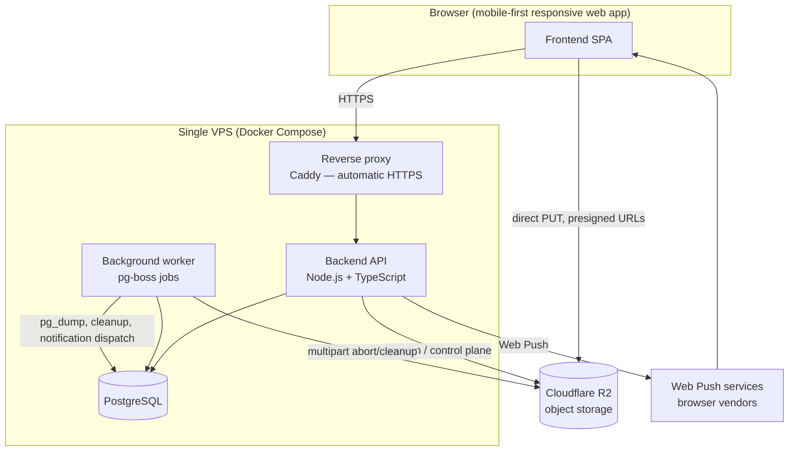

# 13 — Technical Architecture

## System overview



Static frontend assets are built and deployed independently (see [19-deployment-and-cicd.md](19-deployment-and-cicd.md)) — they can be served from the same VPS behind the reverse proxy, or from any static host/CDN, without affecting the backend architecture.

## Technology decisions

Each decision below states the problem it solves, its trade-off, and whether it's required for Phase 1. Full rationale-format records are in [../decisions/](../decisions/README.md).

| Area | Decision | Why | Trade-off | Phase |
|---|---|---|---|---|
| Language | TypeScript (backend & frontend) | One language, shared types (e.g., DTOs) between client and server, catches tenant/permission bugs at compile time | None significant for a team already choosing Node | 1 |
| Backend runtime | Node.js (LTS) | Required by source spec; mature R2/S3 SDK support; large ecosystem for job queues, validation | N/A — given | 1 |
| Backend framework | Fastify | Fast, low overhead (fits "low infra cost"/VPS-sized hardware), first-class schema validation, plugin architecture keeps modules isolated | Smaller ecosystem than Express; less opinionated structure than NestJS (mitigated by our own module conventions — [Code organization](#code-organization)) | 1 |
| Validation | Zod | Single schema definition reused for request validation and inferred TypeScript types | None significant | 1 |
| Database | PostgreSQL | Required by source spec; strong indexing, JSONB where needed, Row-Level Security available for tenant defense-in-depth | None significant | 1 |
| ORM/migrations | Prisma | Mature migration tooling and rollback story, strong TypeScript DX, reduces hand-written SQL bugs for CRUD-heavy modules | Generated client is less flexible for very complex ad-hoc queries (mitigated by raw SQL escape hatch for reporting-style queries) | 1 |
| Object storage | Cloudflare R2 (S3-compatible API) | Required by source spec; no egress fees (relevant given large media files); presigned URL + multipart support matches [07-upload-architecture.md](07-upload-architecture.md) | Not AWS S3 itself — some advanced S3 features may lag; acceptable since only core multipart/presign is used | 1 |
| Background jobs | pg-boss (Postgres-backed queue) | Reuses the database we already run — no new infrastructure service, directly serves "low infrastructure cost" | Lower throughput ceiling than Redis-backed queues (BullMQ) — acceptable at agency scale; revisit if job volume grows | 1 |
| Push notifications | Web Push (VAPID), browser-native | No vendor account/SDK required, works for a responsive web app without native apps, standards-based | Requires a service worker; iOS Safari Web Push support is more recent/limited than Android — tracked as an open question | 1 |
| Auth | Server-side sessions (Postgres-backed), httpOnly cookie | Required to support admin-triggered session revocation cleanly (see [10](10-authentication-and-sessions.md)) | Slightly more server state than pure stateless JWT — acceptable; already need Postgres | 1 |
| Password hashing | Argon2id | Memory-hard, current best practice, resists GPU cracking better than bcrypt | Slightly higher CPU/memory cost per hash — negligible at agency login volume | 1 |
| Reverse proxy / TLS | Caddy | Automatic HTTPS/cert renewal with minimal config — matches small-team ops capacity | Less battle-tested at extreme scale than Nginx — irrelevant at single-VPS scale | 1 |
| Frontend framework | React (Vite SPA) | Authenticated internal tool, not a public marketing site — no SEO/SSR requirement; a static-built SPA is cheap to host and keeps the backend the single source of business logic | Client-side-only means an initial JS payload cost — mitigated by code-splitting and the lazy-loading requirement already in scope | 1 |
| Frontend data layer | TanStack Query | Server-state caching, request de-duplication, and retry policy out of the box — matches performance/caching requirements | None significant | 1 |
| Styling/components | Tailwind CSS + a headless component primitive set | Fast to build consistent, accessible components; supports the shared-component approach in [12-ui-ux-guidelines.md](12-ui-ux-guidelines.md) | None significant | 1 |
| Upload client library | Uppy (`@uppy/core` + `@uppy/aws-s3`), self-hosted signing (no Uppy Companion) | Mature, actively maintained chunking/retry/pause/resume/progress logic for exactly the presigned-multipart-to-S3-compatible-storage pattern this project needs, without hand-rolling it | Pulls in a UI/plugin ecosystem larger than strictly needed if only the core upload engine is used — mitigated by using only `@uppy/core` + `@uppy/aws-s3` (headless), building our own UI on top | 1 |
| E2E/testing | Vitest, Supertest, Playwright | TS-native unit/integration testing; Playwright covers real mobile-viewport and upload-flow E2E | None significant | 1 |
| CI/CD | GitHub Actions + Docker Compose over SSH | Required by source spec; no additional paid CI infra | None significant | 1 |
| Error tracking | Optional hosted error tracker (e.g., Sentry free tier) | Faster diagnosis than log-grepping alone | Adds one external SaaS dependency — kept optional/deferrable, see [20-observability-and-error-handling.md](20-observability-and-error-handling.md) | 1 (optional) |
| Email | Not implemented | Explicitly Phase 2 per source spec | — | 2 |
| Ad platform SDKs | Not implemented | Explicitly Phase 3 | — | 3 |

### Decision status

Everything in the table above is now treated as **final** for Phase 1 planning purposes, except the two rows explicitly marked "optional" or still under `23-open-questions.md`:

- **Final** (implementation should proceed on this basis without re-litigating): TypeScript, Node.js, Fastify, Zod, PostgreSQL, Prisma, Cloudflare R2, pg-boss, Uppy, Web Push/VAPID, server-side sessions, Argon2id, Caddy, React + Vite, TanStack Query, Tailwind CSS, Vitest/Supertest/Playwright, GitHub Actions.
- **Open / your call, not blocking Stage 0–1**: error tracking service (cost decision), monorepo tooling (npm/pnpm workspaces vs. two repos — a low-risk implementation detail). See [23-open-questions.md](23-open-questions.md) for the current full list and what changed in this review.
- **"Final" here means "the spec's committed direction, backed by the rationale in this document and the linked ADRs"** — not "closed to reconsideration if a real problem surfaces during implementation." Each final decision names its own revisit trigger where one is meaningful (see pg-boss and Prisma+RLS below).

### Why Fastify over Express or NestJS

Express is the most familiar choice but is unopinionated by design — this project would end up hand-assembling schema validation, plugin boundaries, and error-handling conventions that Fastify already provides. NestJS enforces more structure (DI, decorators, modules) than a small team needs for a modular monolith of this size, and its ceremony works against the "simplicity and clarity over feature breadth" principle in [01-product-scope.md](01-product-scope.md). Fastify's built-in JSON-schema-based validation hooks integrate cleanly with Zod (via `fastify-type-provider-zod` or equivalent), and its plugin/encapsulation model maps directly onto the domain-module code organization below. See [ADR-0001](../decisions/0001-language-and-runtime.md).

### Why Prisma, and what it requires for Row-Level Security to actually work

Prisma is chosen for its migration tooling, generated types, and DX on CRUD-heavy modules (most of this application). **However, Prisma's connection pooling has a well-known interaction with PostgreSQL session-scoped settings that RLS depends on, and getting this wrong silently defeats the RLS layer.** Full mechanism and required implementation pattern: [14-database-design.md](14-database-design.md#row-level-security-defense-in-depth-and-how-prisma-must-use-it). In short: every tenant-scoped request must run its queries inside a Prisma **interactive transaction** that sets `app.current_company_ids` via transaction-local `set_config(..., true)` before any query — never a bare `SET` outside a transaction, which would leak onto a pooled connection and bleed into an unrelated later request. This is a hard implementation rule, not a suggestion, and Stage 3 of the roadmap ([21-mvp-roadmap.md](21-mvp-roadmap.md)) must include a test that proves it (two rapid concurrent requests from different tenants never see each other's RLS context).

### Why pg-boss, and when to reconsider it

pg-boss uses `SELECT ... FOR UPDATE SKIP LOCKED` polling against a `pgboss` schema in the same PostgreSQL instance — no new service, matching the low-infrastructure-cost principle. Its realistic throughput ceiling is in the range of tens of jobs per second sustained on modest hardware, with a polling-interval-bound dispatch latency (low seconds by default, tunable lower at the cost of more polling load on Postgres) — not comparable to a Redis-backed queue's sub-millisecond dispatch, but **far beyond what Phase 1 needs**: abandoned-upload cleanup runs hourly, manual backups are single-flight and rare, and notification/push dispatch at agency scale ([17-performance-requirements.md](17-performance-requirements.md#load-expectations-phase-1-sizing-assumption-approved-2026-09-14)) is expected in the low single-digit jobs per second at most, even during a burst (e.g., one comment fanning out to a dozen recipients). **Concrete revisit trigger:** if sustained job throughput approaches ~20–50 jobs/second, or any job type needs sub-second dispatch latency, re-evaluate a Redis-backed queue (BullMQ) at that time — this is a swappable implementation detail behind the job-queue interface, not a schema-level commitment. See [ADR-0004](../decisions/0004-background-jobs.md).

### Why Web Push (VAPID)

Covered in full in [08-notifications-and-push.md](08-notifications-and-push.md#push-notifications-web-push) and [ADR-0005](../decisions/0005-push-notifications.md); the short version is that it's a standards-based browser capability requiring no vendor account, matching a responsive-web-app product with no native app in scope.

## Multi-tenancy model

**Shared database, shared schema, row-scoped by `company_id`.**

- Every tenant-owned table carries a `company_id` foreign key (directly or via its parent, per [05-domain-model.md](05-domain-model.md)).
- **Primary enforcement** is at the application layer: every query is built from the authenticated actor's authorized company scope (see [06-permissions-and-authorization.md](06-permissions-and-authorization.md)).
- **Defense-in-depth**: PostgreSQL Row-Level Security (RLS) policies on tenant-owned tables, keyed to a session-scoped `app.current_company_ids` setting the application sets per request, so a bug in application-layer filtering cannot silently leak cross-tenant rows.
- Rejected alternatives: database-per-tenant (operationally expensive to provision/migrate/back up per client at agency scale) and schema-per-tenant (multiplies migration complexity for no isolation benefit beyond what RLS + app-layer checks already provide). See [ADR-0002](../decisions/0002-multi-tenancy-model.md).

## Code organization

Modular by **domain**, not by technical layer, so a module (e.g., `uploads`, `notifications`, `campaigns`) contains its own routes, validation schemas, service logic, and job handlers together:

```text
apps/
  api/            Backend (Fastify)
    src/
      modules/
        auth/
        companies/
        users/
        projects/
        files/           (folders + files + upload sessions)
        calendar/         (content + production)
        publications/
        pending-requests/
        comments/
        topics/
        notifications/    (in-app + push, shared pipeline)
        campaigns/
        branding/
        backups/
        audit/
      shared/            (db client, auth middleware, tenant scoping, error handling)
      jobs/              (pg-boss job definitions, one per background task)
  web/              Frontend (React + Vite)
    src/
      modules/          (mirrors backend module boundaries where practical)
      components/        (shared UI primitives — see 12-ui-ux-guidelines.md)
      lib/
packages/
  shared-types/     (types/DTOs shared between api and web, if not colocated via a monorepo tool)
docs/               This SDD
scripts/            deploy.sh and other operational scripts
```

Exact monorepo tooling (npm/pnpm workspaces, Turborepo, or two independent repos) is an implementation detail left open — see [23-open-questions.md](23-open-questions.md).

## Background jobs

A separate worker process (`apps/api/src/jobs`) consumes pg-boss jobs from the same PostgreSQL database, decoupled from the request/response cycle of the API process. Phase 1 job types: abandoned-upload cleanup ([07-upload-architecture.md](07-upload-architecture.md#abandoned-upload-cleanup-concrete-parameters)), manual backup generation ([11-backup-and-recovery.md](11-backup-and-recovery.md)), and notification/push dispatch ([08-notifications-and-push.md](08-notifications-and-push.md)). Running this as its own container/process (see the [system overview](#system-overview) diagram) means a slow or CPU-heavy job (e.g., a database dump) never blocks API request handling, and the worker can be scaled or restarted independently. Job design conventions (idempotency, one job type per task) are in [15-api-conventions.md](15-api-conventions.md#background-jobs).

## Infrastructure sizing (Phase 1 initial assumption — approved 2026-09-14)

**Initial VPS: 2 vCPU / 8 GB RAM**, running the full Docker Compose stack (reverse proxy, API, worker, PostgreSQL). This is a starting assumption, not a permanent ceiling — see [ADR-0011](../decisions/0011-infrastructure-sizing.md) for the full reasoning and the concrete tuning knobs below, each flagged for revisit once real usage data exists:

- **PostgreSQL `max_connections`:** initial value **60** (Postgres's own default of 100 is unnecessarily high for 8 GB RAM once `shared_buffers` and per-connection memory are accounted for; 60 leaves headroom for the API pool, the worker pool, and occasional direct admin access).
- **Prisma connection pool (API process):** `connection_limit=10` in `DATABASE_URL`. This is sized for concurrent *requests*, not concurrent queries, because the RLS-required interactive-transaction pattern ([14-database-design.md](14-database-design.md#required-pattern-a-transaction-scoped-session-setting-applied-inside-a-prisma-interactive-transaction)) holds a connection for a request's full duration. Ten concurrent in-flight requests comfortably covers the expected agency-scale load ([17-performance-requirements.md](17-performance-requirements.md#load-expectations-phase-1-sizing-assumption-approved-2026-09-14)) with room to spare against the 60-connection ceiling.
- **Prisma connection pool (worker process):** `connection_limit=5` — the worker runs fewer, less latency-sensitive concurrent jobs.
- **pg-boss job concurrency:** capped at **4 concurrent job handlers** in the worker process — on a 2-vCPU box, letting job concurrency scale unbounded would starve the API process of CPU exactly when a backup or a large cleanup batch runs. This is a pg-boss startup option, not a code change, so it's easy to raise later.
- **No server-side video processing on the VPS.** File previews rely on the browser's native video playback against the original file (via a signed R2 URL with HTTP range-request support), not server-side transcoding or thumbnail generation — generating thumbnails/proxies would consume exactly the CPU this sizing has little of. If thumbnailing is ever needed, it belongs on a separate service (e.g., Cloudflare Images, or an R2-triggered worker) — explicitly out of Phase 1 scope.
- **Upload control-plane load is unaffected by this sizing** — presign/part-registration calls are small and infrequent regardless of file size ([07-upload-architecture.md](07-upload-architecture.md)), since file bytes never touch the VPS.
- **Argon2id parameters ([ADR-0009](../decisions/0009-security-parameters.md)) are validated as comfortable against this spec:** 19 MiB per hash means even a burst of 20 concurrent login attempts uses ~380 MiB, a small fraction of 8 GB — no change needed, but this is the number to revisit if the VPS spec ever changes materially.

All of the above are configuration values, not hardcoded constants, and are explicitly expected to be tuned once real production load is observed — see [23-open-questions.md](23-open-questions.md) for the open validation item and [21-mvp-roadmap.md](21-mvp-roadmap.md) Stage 3's connection-pool load-test requirement.

## Environments

- Phase 1: a single production environment on one VPS, plus local development via Docker Compose. Environment variables strictly separate dev/prod secrets — never committed (see [16-security-requirements.md](16-security-requirements.md#secrets-management)).
- The architecture avoids anything that would block adding a staging environment later: the app is stateless (sessions in Postgres, files in R2), so a second environment is "another Docker Compose stack + another database," not a redesign.

## Future scalability path (not built now, not precluded)

- App servers are stateless — horizontal scaling behind the reverse proxy is a deployment change, not a code change.
- Background jobs already run in a separate worker process from the API, so job load can scale independently.
- If tenant/file volume grows enough to strain a single Postgres instance, read replicas or partitioning by `company_id` are viable without a data-model rewrite, because `company_id` is already present on every tenant-owned table.
