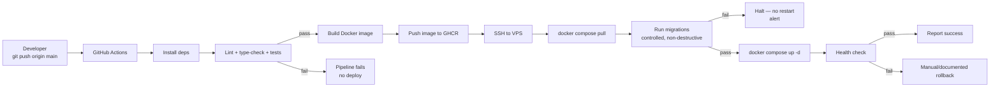

# 19 — Deployment and CI/CD

## Branch strategy

The source spec specifies `master` as the production branch. **This repository's actual default branch is `main`.** This spec uses **`main`** as the production/deploy branch throughout, treating the source spec's `master` as the same concept under this repository's real branch name — see [23-open-questions.md](23-open-questions.md) for this noted (trivial) resolution.

## Pipeline overview

## Requirements

- GitHub Actions triggers automatically on every push to `main`.
- Backend built as a Docker image, pushed to GitHub Container Registry (GHCR) — avoids adding a separate registry service.
- The VPS is reached over SSH using a **dedicated deploy key** stored as a GitHub Secret, scoped to only what the deploy needs (pulling images, running compose commands) — never a personal/admin key.
- VPS connection details (host, SSH user, private key, port) and application environment variables are all provided via GitHub Secrets — never committed to the repository.
- The VPS runs the application via Docker Compose: application service(s), PostgreSQL (separate service, dedicated persistent volume, internal network only — never exposed publicly), and the reverse proxy (Caddy).
- Migrations run as a controlled, separate step (a one-off container/command) before restarting the application services — not as an implicit side effect of container startup that could race with multiple replicas.
- A health check runs after restart; the pipeline reports success/failure clearly in the GitHub Actions log.
- The pipeline never interrupts the service unnecessarily — restarts are the only expected downtime, and only for the service(s) actually changed.

## Manual deploy command

In addition to automatic CI/CD, `scripts/deploy.sh` (or `npm run deploy` wrapping it) provides a manual path for maintenance, testing, or reprocessing a deploy:
- Validates basic project/environment state before proceeding.
- Runs the same build steps as CI.
- Connects to the VPS and updates services the same way the pipeline does.
- Prints a clear result and returns a non-zero exit code on failure.
- This command is a fallback/alternative, not a replacement for the automated pipeline — both paths share the same underlying deploy logic so they can't drift apart.

## Migrations

- Versioned migrations only (see [14-database-design.md](14-database-design.md#migrations)); every migration reviewed for destructive changes before merge.
- A backup is triggered immediately before any migration flagged as potentially destructive ([11-backup-and-recovery.md](11-backup-and-recovery.md)).
- Migrations are tested against a non-production database before being included in a `main` deploy.
- The pipeline records which schema/migration version is live in production.
- No column/table drop ships without an explicit, separately reviewed migration — never bundled silently with an unrelated feature migration.

## Rollback

- Application rollback = redeploying the previous known-good image tag; it never touches the PostgreSQL volume.
- Rollback procedure is documented (exact runbook to be written alongside the CI/CD implementation stage — [21-mvp-roadmap.md](21-mvp-roadmap.md)) and must be executable via the same manual deploy command pointed at a prior tag.
- A rollback after a destructive migration may require restoring from the pre-migration backup — this path is explicitly documented as distinct from a simple image rollback.

## Hard constraints (never automated)

- Never run `docker compose down -v` against production.
- Never delete or recreate the PostgreSQL volume as part of any deploy step.
- Never delete data automatically to "recover" from a failed deploy — the pipeline halts instead and surfaces the failure.
- Never log secrets — GitHub Actions' secret masking is relied upon but not assumed infallible; secrets are never manually echoed into logs.

## Expected repository files

- `.github/workflows/deploy.yml`
- `Dockerfile` (backend; a separate one for the frontend build if not served by the same image)
- `docker-compose.yml` (and a `docker-compose.override.yml` or equivalent for local development)
- `.env.example`
- `scripts/deploy.sh`
- VPS setup documentation and the required-GitHub-Secrets list (to be written as part of the CI/CD implementation stage, not invented speculatively here — see [21-mvp-roadmap.md](21-mvp-roadmap.md))
- Rollback runbook

None of these are created in this SDD stage — they belong to the implementation roadmap's CI/CD stage, once the application itself exists to deploy.
